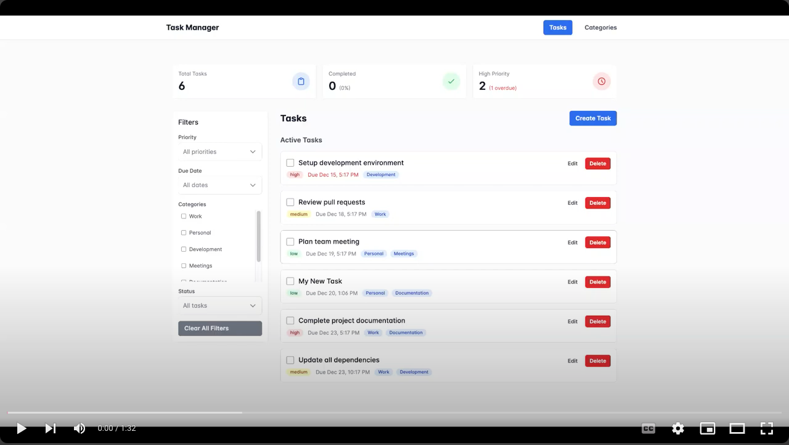

# Todo Application

A full-stack todo list application built with Laravel (Backend) and Vue.js (Frontend), featuring task management with rich metadata and filtering capabilities.

## Project Demo

[](https://www.youtube.com/watch?v=U34vCUpzD-M)

## Quick Start

1. Clone the repository:
```bash
git clone <repository-url>
cd todo-app
```

2. Follow the setup instructions in:
- [Backend README](todo-backend/README.md)
- [Frontend README](todo-frontend/README.md)

## Deployment

For detailed deployment instructions, see the [Deployment Guide](deployment-guide.md)

## Features

- Task Management
  - Create, update, and delete tasks
  - Set due dates and priority levels
  - Mark tasks as complete
  - Categorize tasks with custom tags

- Task Organization
  - Filter tasks by multiple attributes
  - Sort by various fields
  - Separate views for active and completed tasks

- Clean, Responsive Interface
  - Modern UI with PrimeVue components
  - Mobile-friendly design
  - Intuitive task management

## Tech Stack

- **Backend**: Laravel 10, MySQL
- **Frontend**: Vue.js 3 (Composition API), Tailwind CSS
- **Components**: PrimeVue
- **API**: RESTful with proper resource handling